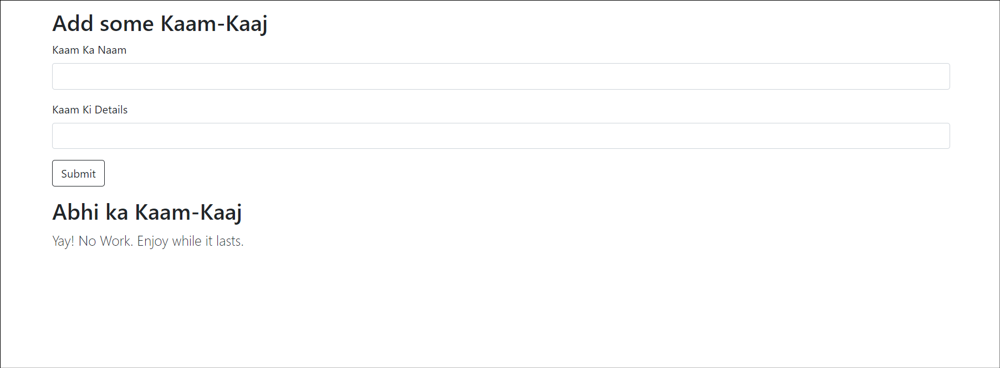
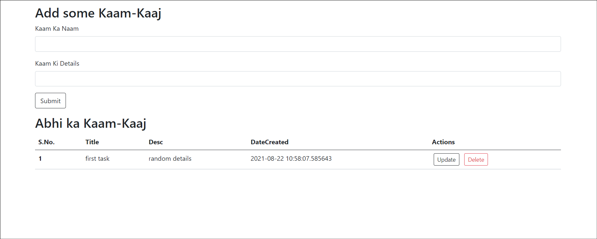

# Kaam-Kaaj-App | ToDoList App
[live website](https://kaam-kaaj-app.herokuapp.com/)
## About
Built a dope to do list app using flask.

## Highlights 

- Creating a flask minimal app
- static and templates directories
- Adding Bootstrap
- Creating a database for the To-Do App
- SQLAlchemy database URI
- Querying Records
- Adding Loop Counter
- Getting forms working
- Updating To-do Items
- Template Inheritance / creating base template
- CRUD operation
- Making update operation work

## How to run
- Install dependencies described in requirements.txt
- cd into the directory of app
- initiate database by running the following :

```
python
from app import db
db.create_all()
```

- Now run the app on local host

```
python app.py
```

- Now go and organise your tasks

## Screenshots




